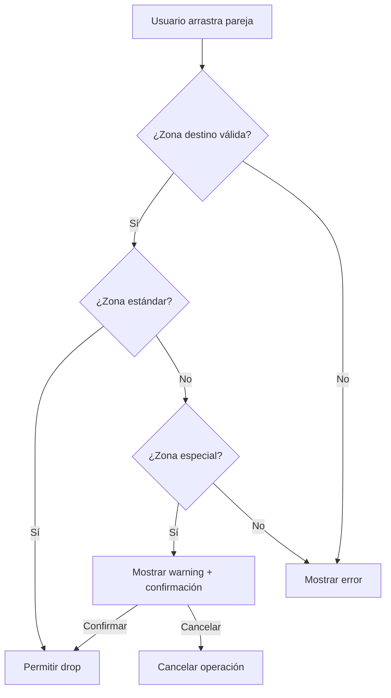

# Sistema de Validación de Torneos

## Descripción General

El Sistema de Validación de Torneos es una arquitectura modular y extensible que proporciona reglas flexibles para diferentes formatos de torneo, con validación inteligente y avisos no intrusivos para los usuarios.

## 🎯 Características Principales

### ✅ **Configuración por Formato**
- **American 2**: Zonas de 3-4 parejas (máx 5), 2-3 partidos por pareja
- **American 3**: Zonas de 3-4 parejas (máx 5), 3-4 partidos por pareja  
- **Long**: Zonas de 4-8 parejas, round-robin completo

### ✅ **Reglas de Clasificación**
- **Zonas 3-4**: Todas las parejas clasifican al bracket (100%)
- **Zona 5**: Solo 4 parejas clasifican, 1 queda eliminada (80%)
- Configuración flexible por formato de torneo

### ✅ **Validación Inteligente**
- Avisos contextuales no intrusivos
- Mensajes de consecuencias claras
- Confirmación para acciones con eliminación
- Validación en tiempo real durante drag & drop

### ✅ **UI Components**
- Indicadores de capacidad con tooltips informativos
- Feedback visual durante operaciones de arrastre
- Badges de estado con colores semánticos
- Componentes reutilizables y configurables

## 🏗️ Arquitectura

```
types/tournament-rules.types.ts          # Definiciones de tipos TypeScript
config/tournament-formats.config.ts     # Configuraciones específicas por formato
lib/services/
  ├── zone-validation.service.ts         # Lógica de validación
  └── tournament-config.service.ts       # Gestión de configuraciones
hooks/
  ├── use-tournament-validation.ts       # Hook principal de validación
  └── use-tournament-format.ts           # Hook de formato de torneo
components/tournament/zones/components/
  ├── ZoneCapacityIndicator.tsx          # Indicador de capacidad
  ├── DragDropFeedback.tsx               # Feedback de drag & drop
  └── index.ts                           # Exportaciones centralizadas
```

## 📖 Guía de Uso

### 1. Configuración Básica

```typescript
import { useTournamentValidation } from '@/hooks/use-tournament-validation'

function MyZoneComponent({ tournamentId, formatId = 'AMERICAN_2' }) {
  const {
    validateZoneAddition,
    getZoneStatusDescription,
    isZoneDefault,
    isZoneOverflow
  } = useTournamentValidation({ tournamentId, formatId })
  
  // Validar antes de agregar pareja a zona
  const validation = validateZoneAddition(currentZoneSize)
  if (!validation.allowed) {
    showError(validation.message)
    return
  }
  
  // Mostrar consecuencias si hay eliminación
  if (validation.consequences?.eliminated > 0) {
    showWarning(`${validation.consequences.eliminated} pareja será eliminada`)
  }
}
```

### 2. Indicador de Capacidad

```typescript
import { ZoneCapacityDetails } from '@/components/tournament/zones/components'

<ZoneCapacityDetails
  currentSize={zone.couples.length}
  zoneId={zone.id}
  zoneName={zone.name}
  formatId="AMERICAN_2"
  tournamentId={tournamentId}
/>
```

### 3. Feedback de Drag & Drop

```typescript
import { ZoneDragFeedback } from '@/components/tournament/zones/components'

<ZoneDragFeedback
  isOver={isOver}
  canDrop={canDrop}
  feedback={feedback}
  level={level}
  consequences={consequences}
  zoneName={zone.name}
/>
```

### 4. Hook de Drag & Drop Mejorado

```typescript
const {
  validateDrop,
  getDragOverFeedback,
  // Nuevas propiedades de validación
  tournamentRules,
  maxCapacity,
  defaultCapacity
} = useDragDropOperations({
  allowSwapping: true,
  allowDeletion: true,
  restrictedCouples,
  tournamentId,
  formatId: 'AMERICAN_2'
})
```

## 🎨 Componentes UI

### ZoneCapacityIndicator

Muestra el estado de capacidad de una zona con información contextual.

**Variantes:**
- `compact`: Solo badge con capacidad
- `default`: Badge + icono + tooltip
- `detailed`: Información completa del formato

**Props principales:**
- `currentSize`: Número actual de parejas
- `formatId`: Formato del torneo ('AMERICAN_2', etc.)
- `showConsequences`: Mostrar información de eliminación
- `variant`: Nivel de detalle ('compact' | 'default' | 'detailed')

### DragDropFeedback

Proporciona feedback visual durante operaciones de drag and drop.

**Características:**
- Mensajes contextuales por nivel (info/warning/error)
- Confirmación para acciones con consecuencias
- Preview de eliminaciones
- Animaciones suaves

### Niveles de Validación

- **`info`**: Operación normal, sin problemas
- **`warning`**: Acción permitida pero con consecuencias (ej: zona de 5)
- **`error`**: Acción no permitida

## 🔧 Configuración de Formatos

### Crear Nuevo Formato

```typescript
// En config/tournament-formats.config.ts
export const CUSTOM_TOURNAMENT_RULES: TournamentRules = {
  formatId: 'CUSTOM',
  formatName: 'Torneo Personalizado',
  
  zoneCapacity: {
    default: 6,      // Capacidad estándar
    max: 8,          // Máximo permitido
    allowOverflow: true
  },
  
  advancement: {
    4: { qualified: 2, eliminated: 2, strategy: 'TOP_N' },
    5: { qualified: 2, eliminated: 3, strategy: 'TOP_N' },
    6: { qualified: 3, eliminated: 3, strategy: 'TOP_N' }
  },
  
  warnings: {
    enableOverflowWarnings: true,
    showEliminationPreview: true,
    showMatchCountChanges: true
  }
}
```

### Registrar Formato

```typescript
// Agregar al registro
export const TOURNAMENT_FORMATS: Record<string, TournamentFormatConfig> = {
  'AMERICAN_2': AMERICAN_2_CONFIG,
  'AMERICAN_3': AMERICAN_3_CONFIG,
  'LONG': LONG_CONFIG,
  'CUSTOM': CUSTOM_CONFIG  // ← Nuevo formato
}
```

## 🧪 Testing

El sistema incluye tests comprensivos:

```typescript
// Ejecutar tests
npm test zone-validation.service.test.ts

// Tests incluyen:
// ✅ Validación de capacidad por formato
// ✅ Consecuencias de eliminación 
// ✅ Movimiento entre zonas
// ✅ Casos edge y compatibilidad entre formatos
```

## 🎯 Casos de Uso

### Caso 1: Zona Estándar (3-4 parejas)
- ✅ Badge verde "Todos clasifican"
- ✅ Operaciones de drag & drop sin restricciones
- ✅ Sin avisos de eliminación

### Caso 2: Zona Especial (5 parejas)
- ⚠️ Badge amarillo "Zona especial"
- ⚠️ Tooltip: "1 pareja quedará eliminada, 3 partidos por pareja"
- ⚠️ Confirmación antes de crear zona de 5

### Caso 3: Límite Excedido (>5 parejas)
- ❌ Operación bloqueada
- ❌ Mensaje: "Máximo 5 parejas por zona"
- ❌ Sugerencia: "Crea una nueva zona"

## 📊 Flujo de Usuario



## 🔮 Extensibilidad

### Agregar Nueva Validación

```typescript
// En zone-validation.service.ts
static validateCustomRule(zoneSize: number, customData: any): ZoneValidationResult {
  // Lógica personalizada
  return {
    allowed: true,
    level: 'info',
    message: 'Regla personalizada aplicada'
  }
}
```

### Hook Personalizado

```typescript
export function useCustomTournamentValidation(tournamentId: string) {
  const base = useTournamentValidation({ tournamentId })
  
  // Agregar lógica personalizada
  const customValidate = useCallback((data) => {
    // Validación específica
  }, [])
  
  return {
    ...base,
    customValidate
  }
}
```

## 🎉 Beneficios

1. **Modularidad**: Cada formato tiene su configuración independiente
2. **Extensibilidad**: Fácil agregar nuevos formatos sin afectar existentes
3. **Type Safety**: TypeScript garantiza consistencia en toda la app
4. **UX Mejorada**: Avisos claros y no intrusivos para el usuario
5. **Mantenibilidad**: Código organizado y bien documentado
6. **Testeable**: Cobertura completa con tests automatizados

## 🚀 Próximos Pasos

- [ ] Integración con algoritmo de bracket (pendiente de implementación)
- [ ] Persistencia de configuraciones en base de datos
- [ ] Dashboard de administración para crear formatos personalizados
- [ ] Analytics de uso de formatos
- [ ] Migración automática entre formatos