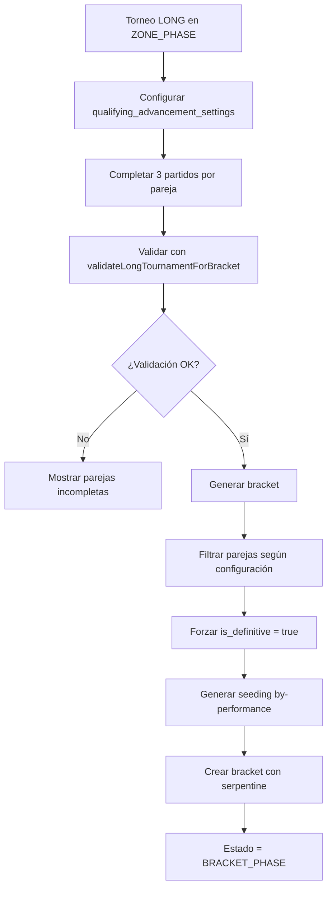

# LONG TOURNAMENT BRACKET SYSTEM

## Resumen

Sistema completo para generación de brackets en torneos formato LONG con soporte para configuración de avance clasificatorio. Implementado usando strategy pattern y reutilizando 95% de la infraestructura existente de torneos AMERICAN.

## Arquitectura

### 1. Strategy Pattern Bridge

**Archivo**: `lib/services/bracket-generator-v2.ts`

El `PlaceholderBracketGenerator` implementa un bridge pattern para soportar ambos formatos:

```typescript
async generatePlaceholderSeeding(tournamentId: string): Promise<PlaceholderSeed[]> {
  const tournament = await this.getTournament(tournamentId)

  // Bridge pattern: Auto-detección de formato
  if (tournament.type === 'LONG') {
    return this.generateLongSeeding(tournamentId)
  } else {
    return this.generateAmericanSeeding(tournamentId)
  }
}
```

### 2. Diferencias por Formato

| Aspecto | AMERICAN | LONG |
|---------|----------|------|
| **Zonas** | Múltiples (A, B, C...) | Una sola zona |
| **Seeding** | "1A", "2B", "3C" | "1", "2", "3" |
| **Estrategia** | by-zones | by-performance |
| **Placeholders** | Por zona | Por posición global |

## Componentes del Sistema

### 1. Validación de Torneo LONG

**Archivo**: `utils/tournament-long-validation.ts`

**Función principal**: `validateLongTournamentForBracket(tournamentId: string)`

**Validaciones realizadas:**
- ✅ Formato debe ser 'LONG'
- ✅ Estado debe ser 'ZONE_PHASE'
- ✅ Todas las parejas completaron exactamente 3 partidos de zona
- ✅ Consideración de `qualifying_advancement_settings`

**Retorna**:
```typescript
interface LongTournamentValidationResult {
  canGenerate: boolean
  reason?: string
  details?: {
    totalCouples: number
    completedCouples: number
    pendingCouples: number
    qualifyingAdvancementEnabled?: boolean
    couplesAdvance?: number
    totalCouplesAdvancing?: number
    // ... más campos
  }
}
```

### 2. Configuración de Avance Clasificatorio

**Tabla**: `tournament_ranking_config.qualifying_advancement_settings`

**Estructura JSON**:
```json
{
  "enabled": true,
  "couples_advance": 12
}
```

**Comportamiento**:
- `enabled: false` → Todas las parejas avanzan al bracket
- `enabled: true` → Solo las mejores N parejas avanzan

### 3. Generación de Seeding LONG

**Método**: `generateLongSeeding(tournamentId: string)`

**Proceso**:
1. **Configuración**: Lee `qualifying_advancement_settings`
2. **Zona única**: Obtiene la zona del torneo LONG
3. **Filtrado**: Aplica `.slice(0, couplesAdvance)` si está configurado
4. **Seeding**: Genera seeds 1, 2, 3... según ranking de zona
5. **Serpentine**: Aplica algoritmo de distribución en bracket

```typescript
// Aplicar filtro de clasificación
const zonePositions = qualifyingAdvancementEnabled && couplesAdvance
  ? (allZonePositions || []).slice(0, couplesAdvance)
  : allZonePositions
```

### 4. Auto-detección de Estrategia

**Archivo**: `utils/bracket-seeding-algorithm.ts`

**Función**: `generateTournamentSeeding(tournamentId, supabase, strategy?)`

**Auto-detección**:
```typescript
if (!strategy) {
  const { data: tournament } = await supabase
    .from('tournaments')
    .select('type')
    .eq('id', tournamentId)
    .single()

  strategy = tournament.type === 'LONG' ? 'by-performance' : 'by-zones'
}
```

## API Endpoints

### 1. Validación - GET `/api/tournaments/[id]/validate-long-bracket`

**Propósito**: Verificar si el torneo LONG puede generar bracket

**Respuesta**:
```json
{
  "canGenerate": true,
  "details": {
    "totalCouples": 16,
    "completedCouples": 16,
    "qualifyingAdvancementEnabled": true,
    "couplesAdvance": 12,
    "totalCouplesAdvancing": 12
  }
}
```

### 2. Generación - POST `/api/tournaments/[id]/generate-long-bracket`

**Propósito**: Generar bracket para torneo LONG

**Proceso**:
1. **Autenticación**: Verificar usuario
2. **Permisos**: CLUB owner + ORGANIZADOR
3. **Validación**: Llamar `validateLongTournamentForBracket`
4. **Forzar definitivo**: `UPDATE zone_positions SET is_definitive = true`
5. **Seeding**: Usar `generateTournamentSeeding` con auto-detección
6. **Bracket**: Generar usando sistema existente
7. **Estado**: Actualizar torneo a 'BRACKET_PHASE'

**Respuesta exitosa**:
```json
{
  "success": true,
  "seeding": {
    "strategy": "by-performance",
    "totalCouples": 12,
    "bracketSize": 16
  },
  "bracket": {
    "matchesCreated": 15,
    "rounds": ["ROUND_1", "ROUND_2", "SEMIFINALS", "FINAL"]
  }
}
```

## Interfaz de Usuario

### 1. Componente LongBracketGenerator

**Archivo**: `components/tournament/long/LongBracketGenerator.tsx`

**Características**:
- ✅ Validación en tiempo real
- ✅ Información de clasificación limitada
- ✅ Progreso detallado de parejas
- ✅ Lista expandible de parejas incompletas
- ✅ Estados de loading y error

**Información mostrada**:
```jsx
{/* Si qualifying_advancement_settings.enabled */}
<div className="bg-amber-50 border border-amber-200">
  <span>Clasificación Limitada</span>
  <div>Solo {couplesAdvance} de {totalCouples} parejas avanzarán</div>
</div>

{/* Botón con información */}
<Button>
  Generate Bracket ({totalCouplesAdvancing} couples)
</Button>
```

### 2. Integración en Settings

**Archivo**: `app/(main)/tournaments/[id]/settings/components/SettingsContainer.tsx`

**Renderizado condicional**:
```jsx
{tournament.type === 'LONG' && (
  <LongBracketGenerator
    tournamentId={tournament.id}
    tournament={tournament}
    onBracketGenerated={() => window.location.reload()}
  />
)}
```

## Casos de Uso

### Caso 1: Torneo LONG sin límite clasificatorio

1. **Configuración**: `qualifying_advancement_settings.enabled = false`
2. **Validación**: Todas las parejas deben completar 3 partidos
3. **Resultado**: Todas las parejas avanzan al bracket

### Caso 2: Torneo LONG con límite clasificatorio

1. **Configuración**: `qualifying_advancement_settings = { enabled: true, couples_advance: 12 }`
2. **Validación**: Todas las parejas deben completar 3 partidos
3. **Filtrado**: Solo las mejores 12 parejas por ranking de zona
4. **Resultado**: Bracket con 12 parejas (necesita 4 BYEs para bracket de 16)

### Caso 3: Validación fallida

1. **Problema**: Algunas parejas no completaron 3 partidos
2. **UI**: Muestra lista detallada de parejas incompletas
3. **Acción**: Organizador debe completar partidos faltantes

## Flujo Completo



## Ventajas del Sistema

1. **Reutilización**: 95% del código existente de AMERICAN
2. **Flexibilidad**: Soporte para ambos formatos sin duplicación
3. **Escalabilidad**: Fácil agregar nuevos formatos
4. **Configurabilidad**: Control granular del avance clasificatorio
5. **Validación robusta**: Verificaciones completas antes de generar
6. **UX clara**: Información detallada para el organizador

## Archivos Modificados/Creados

### Nuevos
- `utils/tournament-long-validation.ts`
- `app/api/tournaments/[id]/validate-long-bracket/route.ts`
- `app/api/tournaments/[id]/generate-long-bracket/route.ts`
- `components/tournament/long/LongBracketGenerator.tsx`

### Modificados
- `lib/services/bracket-generator-v2.ts` (bridge pattern)
- `utils/bracket-seeding-algorithm.ts` (auto-detección)
- `app/(main)/tournaments/[id]/settings/components/SettingsContainer.tsx`
- `app/(main)/tournaments/[id]/settings/page.tsx`

## Notas Técnicas

1. **is_definitive temporal**: Se fuerza `true` durante generación para compatibilidad con sistema existente
2. **Conteo de partidos**: Usa tabla `matches` con filtro `round = 'ZONE'` y `status != 'PENDING'`
3. **Permisos**: Solo CLUB owner + rol ORGANIZADOR pueden generar brackets
4. **Rollback**: No implementado - el organizador debe decidir cuándo generar
5. **Serpentine**: Mismo algoritmo que AMERICAN, pero con seeds simples (1, 2, 3...)