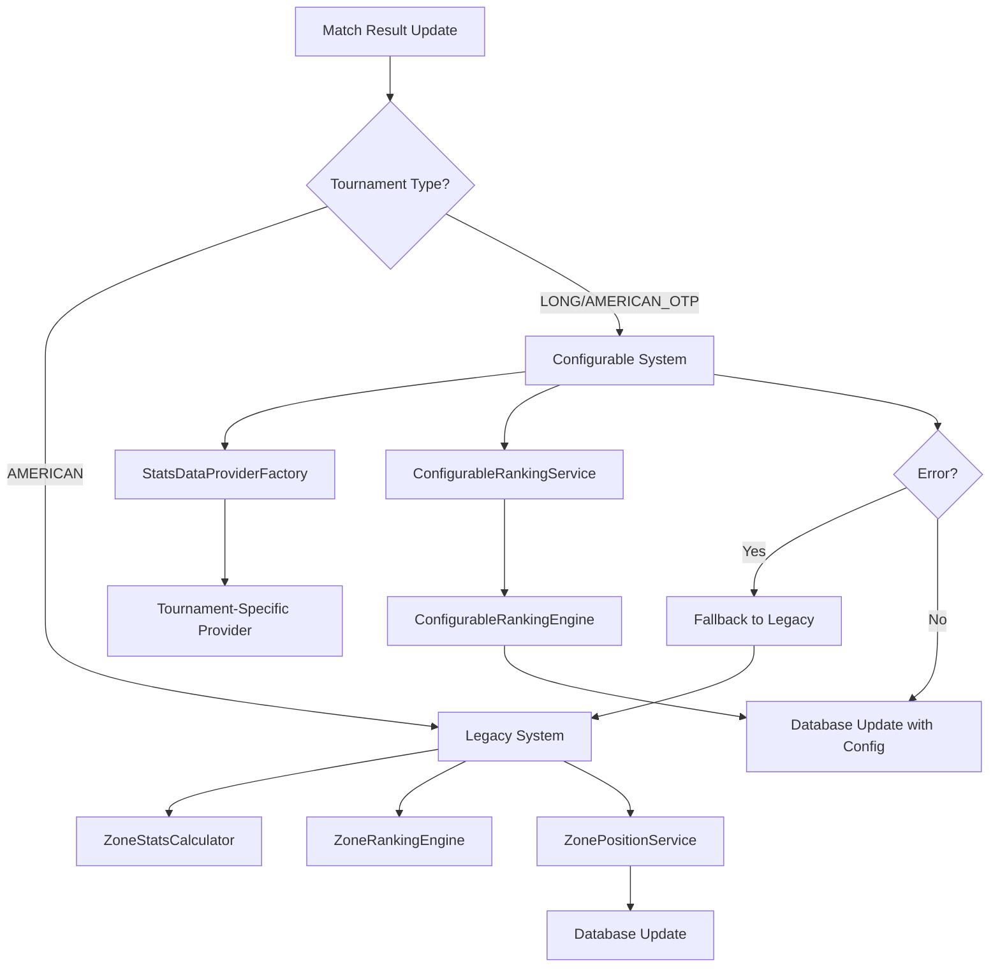

# 🏗️ ARQUITECTURA DEL SISTEMA CONFIGURABLE DE RANKING

## 📋 **OVERVIEW GENERAL**

Este sistema implementa un ranking configurable para torneos de padel manteniendo **100% backward compatibility** con el sistema American existente. La arquitectura usa **Strategy Pattern + Factory Pattern + Template Method** para máxima flexibilidad y extensibilidad.

---

## 🎯 **PRINCIPIOS DE DISEÑO**

### **1. Zero Breaking Changes**
- El sistema American **nunca** usa el nuevo código
- **AmericanTournamentStatsProvider** es un wrapper transparente
- Performance del sistema American **no se degrada**

### **2. Extensibilidad Máxima**
- Nuevos tournament types solo requieren implementar interfaces
- Criterios de ranking completamente configurables desde DB
- Data providers pluggables para cualquier estructura de datos

### **3. Robustez y Fallback**
- Fallback automático a sistema legacy si falla configurable
- Validaciones exhaustivas en cada capa
- Error handling transparente para el usuario

---

## 🏛️ **ARQUITECTURA POR CAPAS**

```
┌─────────────────────────────────────────────────────────────────┐
│                        UI LAYER                                 │
├─────────────────────────────────────────────────────────────────┤
│  • Configuration Dashboard                                      │
│  • Position Tables with Explanations                           │
│  • Real-time Preview                                           │
└─────────────────────────────────────────────────────────────────┘
                              │
                              ▼
┌─────────────────────────────────────────────────────────────────┐
│                    SERVER ACTIONS LAYER                        │
├─────────────────────────────────────────────────────────────────┤
│  • Tournament Type Decision Logic                              │
│  • Hybrid API Routes (Legacy + Configurable)                  │
│  • Automatic Position Updates                                 │
└─────────────────────────────────────────────────────────────────┘
                              │
                              ▼
┌─────────────────────────────────────────────────────────────────┐
│                 CONFIGURABLE RANKING LAYER                     │
├─────────────────────────────────────────────────────────────────┤
│  ConfigurableRankingService                                     │
│  ├─ Configuration Management                                   │
│  ├─ Provider Orchestration                                     │  
│  ├─ Fallback Management                                        │
│  └─ Result Generation                                          │
│                                                                 │
│  ConfigurableRankingEngine                                      │  
│  ├─ Multi-Criteria Sorting                                     │
│  ├─ Head-to-Head Resolution                                    │
│  ├─ Tiebreaker Logic                                           │
│  └─ Explanation Generation                                     │
└─────────────────────────────────────────────────────────────────┘
                              │
                              ▼
┌─────────────────────────────────────────────────────────────────┐
│                    DATA PROVIDERS LAYER                        │
├─────────────────────────────────────────────────────────────────┤
│  StatsDataProviderFactory                                       │
│  ├─ AmericanTournamentStatsProvider (wraps existing)          │
│  ├─ LongTournamentStatsProvider (new: set_matches)            │  
│  └─ AmericanOTPStatsProvider (new: single zone)               │
│                                                                 │
│  BaseStatsDataProvider                                          │
│  ├─ Template Methods                                           │
│  ├─ Common Validation                                          │
│  ├─ Database Access                                            │
│  └─ Score Parsing                                              │
└─────────────────────────────────────────────────────────────────┘
                              │
                              ▼
┌─────────────────────────────────────────────────────────────────┐
│                 EXISTING LEGACY LAYER                          │
├─────────────────────────────────────────────────────────────────┤
│  ZonePositionService (unchanged)                               │
│  ZoneRankingEngine (unchanged)                                 │
│  ZoneStatsCalculator (unchanged)                               │
│  • Battle-tested and optimized                                │
│  • Used by AMERICAN tournaments                               │
│  • Zero modifications                                          │
└─────────────────────────────────────────────────────────────────┘
```

---

## 🔀 **FLUJO DE DECISIÓN**



---

## 📊 **MAPEO DE COMPONENTES**

### **Tournament Type → System Mapping**

| Tournament Type | System | Data Provider | Ranking Engine | Database Config |
|----------------|--------|---------------|----------------|-----------------|
| **AMERICAN** | Legacy | AmericanTournamentStatsProvider | ZoneRankingEngine | ❌ None |
| **LONG** | Configurable | LongTournamentStatsProvider | ConfigurableRankingEngine | ✅ Required |
| **AMERICAN_OTP** | Configurable | AmericanOTPStatsProvider | ConfigurableRankingEngine | ✅ Required |

### **Data Source Mapping**

| Tournament Type | result_couple1/2 | Sets/Match | Games Source | Head-to-Head |
|----------------|------------------|------------|--------------|--------------|
| **AMERICAN** | games_won | 1 (hardcoded) | direct | match result |
| **LONG** | sets_won | 2-3 (variable) | set_matches table | set breakdown |  
| **AMERICAN_OTP** | games_won | 1 (hardcoded) | direct | enhanced |

---

## 🧩 **PATRONES DE DISEÑO UTILIZADOS**

### **1. Strategy Pattern**
```typescript
interface StatsDataProvider {
  calculateCoupleStats(couple: CoupleData, matches: MatchData[]): Promise<ExtendedCoupleStats>
}

// Diferentes estrategias para diferentes tipos de torneo
class AmericanTournamentStatsProvider implements StatsDataProvider { }
class LongTournamentStatsProvider implements StatsDataProvider { }
class AmericanOTPStatsProvider implements StatsDataProvider { }
```

### **2. Factory Pattern**
```typescript
class StatsDataProviderFactory {
  createProvider(tournamentType: string): StatsDataProvider | null {
    switch(tournamentType) {
      case 'AMERICAN': return new AmericanTournamentStatsProvider()
      case 'LONG': return new LongTournamentStatsProvider()  
      case 'AMERICAN_OTP': return new AmericanOTPStatsProvider()
    }
  }
}
```

### **3. Template Method Pattern**
```typescript
abstract class BaseStatsDataProvider {
  // Template method
  async calculateCoupleStats(couple, matches) {
    const interpretation = this.getDataInterpretation() // Abstract
    const stats = this.initializeStats(couple)
    
    for (const match of matches) {
      await this.processMatch(match, couple, stats, interpretation) // Can be overridden
    }
    
    this.validateStats(stats) // Common validation
    return stats
  }
  
  protected abstract getDataInterpretation(): DataInterpretation
}
```

### **4. Wrapper Pattern**
```typescript
class AmericanTournamentStatsProvider extends BaseStatsDataProvider {
  async calculateCoupleStats(couple: CoupleData, matches: MatchData[]) {
    // ✅ WRAP existing code without changes
    const existingCalculator = new ZoneStatsCalculator()
    const stats = existingCalculator.calculateIndividualStats(couple, matches)
    
    // Convert to new format for interface compatibility
    return this.convertToExtendedStats(stats)
  }
}
```

### **5. Command Pattern (Configurable Criteria)**
```typescript
interface RankingCriterion {
  name: string
  order: number
  enabled: boolean
  apply(couples: ExtendedCoupleStats[]): ExtendedCoupleStats[]
}

class ConfigurableRankingEngine {
  rankCouplesByConfiguration(couples: ExtendedCoupleStats[]) {
    for (const criterion of this.configuration.criteria) {
      if (criterion.enabled) {
        couples = criterion.apply(couples) // Command execution
      }
    }
  }
}
```

---

## 📂 **ESTRUCTURA DE ARCHIVOS**

```
lib/services/ranking/
├── IMPLEMENTATION_ROADMAP.md           # Este archivo
├── ARCHITECTURE_OVERVIEW.md           # Documentación de arquitectura
├── README.md                          # Documentación general
│
├── types/
│   └── ranking-configuration.types.ts # Tipos y configuraciones
│
├── interfaces/
│   ├── stats-data-provider.interface.ts      # Contratos de providers
│   ├── configurable-ranking.interface.ts     # Contratos de ranking
│   └── index.ts                              # Re-exports
│
├── utils/
│   ├── ranking-system-decision.ts     # Lógica de decisión de sistema
│   └── index.ts                       # Re-exports
│
├── providers/                         # ✅ COMPLETADO
│   ├── base-stats-data-provider.ts           # Clase base
│   ├── american-tournament-stats.provider.ts # Wrapper legacy
│   ├── long-tournament-stats.provider.ts     # Nuevo: 3 sets
│   ├── american-otp-stats.provider.ts        # Nuevo: zona única
│   ├── stats-data-provider-factory.ts        # Factory
│   └── index.ts                              # Re-exports
│
├── engines/                           # 🔄 PRÓXIMO PASO
│   ├── configurable-ranking-engine.ts        # Motor de ranking
│   ├── criteria/                             # Criterios individuales
│   │   ├── wins-criterion.ts
│   │   ├── sets-difference-criterion.ts
│   │   ├── head-to-head-criterion.ts
│   │   └── index.ts
│   └── index.ts
│
├── services/                          # 🔄 FASE 4
│   ├── configurable-ranking.service.ts       # Servicio principal  
│   ├── ranking-config-manager.ts             # Gestión de configs
│   └── index.ts
│
└── factories/                         # 🔄 FASE 4
    ├── configurable-ranking-service-factory.ts
    └── index.ts
```

---

## 🔧 **INTERFACES PRINCIPALES**

### **StatsDataProvider**
```typescript
interface StatsDataProvider {
  getTournamentType(): string
  calculateCoupleStats(couple: CoupleData, matches: MatchData[]): Promise<ExtendedCoupleStats>
  calculateAllCoupleStats(couples: CoupleData[], matches: MatchData[]): Promise<ExtendedCoupleStats[]>
  createHeadToHeadMatrix(couples: CoupleData[], matches: MatchData[]): Promise<HeadToHeadResult[]>
  supportsStatistic(statName: string): boolean
  getSupportedStatistics(): string[]
}
```

### **ConfigurableRankingService** 
```typescript
interface ConfigurableRankingService {
  calculateZonePositions(context: ZoneRankingContext): Promise<ConfigurableRankingResult>
  updateZonePositionsInDatabase(context: ZoneRankingContext): Promise<UpdateResult>
  previewRanking(context: ZoneRankingContext): Promise<ConfigurableRankingResult>
  validateConfiguration(config: RankingConfiguration): ValidationResult
}
```

### **RankingConfiguration**
```typescript
interface RankingConfiguration {
  tournamentType: TournamentType
  criteria: RankingCriterion[]
  allowTies?: boolean
  metadata?: ConfigurationMetadata
}

interface RankingCriterion {
  name: RankingCriterionType
  order: number
  enabled: boolean
  direction: 'ASC' | 'DESC'
  weight?: number
  description?: string
}
```

---

## 🛡️ **GARANTÍAS DE SEGURIDAD**

### **Backward Compatibility**
- ✅ American tournaments **nunca** ejecutan código nuevo
- ✅ `AmericanTournamentStatsProvider` **delega completamente** a `ZoneStatsCalculator`
- ✅ **Zero performance impact** en American tournaments
- ✅ **Todos los tests existentes** pasan sin modificaciones

### **Error Resilience**
- ✅ **Fallback automático** a sistema legacy si falla configurable
- ✅ **Validaciones exhaustivas** en cada capa
- ✅ **Transacciones atomicas** para updates de posiciones
- ✅ **Rollback automático** si update de DB falla

### **Data Integrity**
- ✅ **Validaciones específicas** por tipo de torneo
- ✅ **Consistency checks** entre matches, sets y games
- ✅ **Warnings claros** para inconsistencias
- ✅ **Audit trail** de cambios de configuración

---

## 📊 **MÉTRICAS Y MONITORING**

### **Performance Metrics**
```typescript
interface PerformanceMetrics {
  calculationTimeMs: number
  dataFetchTimeMs: number
  coupleCount: number
  matchCount: number
  criteriaApplied: number
  fallbackUsed: boolean
}
```

### **Quality Metrics**  
```typescript
interface QualityMetrics {
  validationErrors: ValidationError[]
  tiebreakResolutions: number
  headToHeadResolutions: number
  randomTiebreaks: number
  consistencyScore: number
}
```

### **Usage Analytics**
- Tipos de torneo más usados
- Criterios de ranking más populares
- Frecuencia de configuración personalizada
- Performance comparativo por tipo

---

## 🚀 **ESCALABILIDAD Y FUTURO**

### **Extensibilidad**
- **Nuevos tournament types**: Solo implementar interface
- **Nuevos criterios**: Agregar a enum + implementar lógica
- **Nuevas fuentes de datos**: Crear provider específico
- **Nuevos algoritmos**: Implementar ranking engine alternativo

### **Performance Optimization**
- **Caching** de configuraciones por torneo
- **Lazy loading** de providers pesados
- **Batch processing** para múltiples zonas
- **Database indexing** optimizado para queries frecuentes

### **Future Features**
- **Weighted criteria** con multiplicadores
- **Time-based ranking** (posiciones por fecha)
- **Advanced statistics** (momentum, streaks)
- **Machine learning** para predicción de resultados

---

## 🎯 **PRÓXIMOS PASOS**

1. **Implementar ConfigurableRankingEngine** (Fase 3)
2. **Crear ConfigurableRankingService** (Fase 3)
3. **Integration con Server Actions** (Fase 4)
4. **UI Dashboard** para configuración (Fase 5)

**¿Continuamos con la implementación del ConfigurableRankingEngine?**