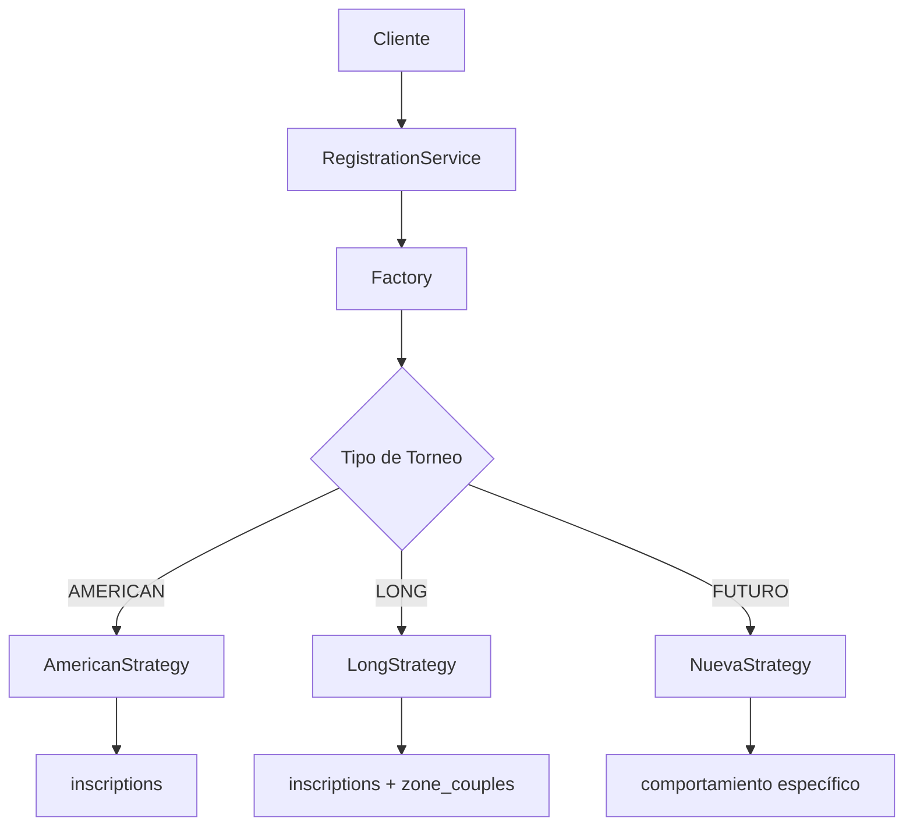

# 🎾 Sistema de Inscripciones con Patrón Strategy

## 📋 Descripción General

Sistema de inscripciones unificado que utiliza el **Patrón Strategy** para manejar diferentes tipos de torneos con comportamientos específicos, manteniendo una API uniforme.

## 🏆 Estado del Sistema

- ✅ **IMPLEMENTACIÓN COMPLETA** (Septiembre 12, 2025)
- ✅ **REFACTORIZACIÓN EXITOSA** - Todas las funciones legacy migradas
- ✅ **100% BACKWARD COMPATIBLE** - Sin breaking changes
- ✅ **PRODUCCIÓN READY** - Sistema probado y estable

📚 **Ver documentación completa de la refactorización**: [REFACTORING-SUMMARY.md](./REFACTORING-SUMMARY.md)
📚 **Guía de migración para desarrolladores**: [MIGRATION-GUIDE.md](./MIGRATION-GUIDE.md)

### 🎯 Problema Resuelto

**Antes:**
```typescript
// Código duplicado con if statements para cada tipo
if (tournament.type === 'LONG') {
  // Inscribir en inscriptions
  // + Asignar a zone_couples
} else if (tournament.type === 'AMERICAN') {
  // Solo inscribir en inscriptions
}
```

**Ahora:**
```typescript
// Una función, comportamiento automático
await registerCouple({ tournamentId, player1Id, player2Id })
// ✅ AMERICAN: solo inscriptions  
// ✅ LONG: inscriptions + zone_couples
// ✅ FUTURO: comportamiento específico
```

## 🏗️ Arquitectura

### 📁 Estructura de Archivos

```
lib/services/registration/
├── index.ts                          # Punto de entrada
├── registration.service.ts           # Service principal
├── registration-strategy.factory.ts  # Factory pattern
├── registration-strategy.interface.ts # Contrato común
├── american-tournament-strategy.ts   # Estrategia AMERICAN
├── long-tournament-strategy.ts       # Estrategia LONG
└── types/
    └── registration-types.ts         # Tipos TypeScript
```

### 🔄 Flujo de Operación



## 🚀 Uso Rápido

### Importación

```typescript
import { 
  registerCouple,
  registerNewPlayersAsCouple,
  registerIndividualPlayer,
  removeCouple 
} from '@/lib/services/registration'
```

### Ejemplos de Uso

#### 1. Registrar Pareja Existente

```typescript
const result = await registerCouple({
  tournamentId: 'abc123',
  player1Id: 'player1',
  player2Id: 'player2'
})

if (result.success) {
  console.log(`✅ Pareja registrada: ${result.coupleId}`)
  console.log(`Zona asignada: ${result.zoneAssigned}`) // true para LONG, false para AMERICAN
} else {
  console.error(`❌ Error: ${result.error}`)
}
```

#### 2. Crear Jugadores Nuevos como Pareja

```typescript
const result = await registerNewPlayersAsCouple({
  tournamentId: 'abc123',
  player1: {
    firstName: 'Juan',
    lastName: 'Pérez',
    phone: '+5411234567',
    dni: '12345678',
    gender: 'MALE'
  },
  player2: {
    firstName: 'Carlos',
    lastName: 'López',
    phone: '+5411234568',
    dni: '87654321',
    gender: 'MALE'
  }
})
```

#### 3. Registrar Jugador Individual

```typescript
const result = await registerIndividualPlayer({
  tournamentId: 'abc123',
  playerId: 'player1'
})
```

#### 4. Eliminar Pareja

```typescript
const result = await removeCouple({
  tournamentId: 'abc123',
  coupleId: 'couple1'
})

console.log(`Removida de ${result.zonesCount} zonas`) // Solo para LONG
```

## 🎮 Tipos de Torneo Soportados

### 🇺🇸 AMERICAN Tournament Strategy

**Características:**
- ✅ Solo maneja tabla `inscriptions`
- ✅ No asigna zonas automáticamente
- ✅ Organizador asigna zonas manualmente después
- ✅ Ideal para torneos con múltiples zonas balanceadas

**Comportamiento:**
```typescript
// AMERICAN Tournament
registerCouple() → inscriptions
removeCouple() → elimina de inscriptions
```

### 🏆 LONG Tournament Strategy  

**Características:**
- ✅ Maneja `inscriptions` + `zone_couples`
- ✅ Asignación automática a zona general única
- ✅ Todas las parejas en la misma zona inicialmente
- ✅ Ideal para fase de grupos → eliminación directa

**Comportamiento:**
```typescript
// LONG Tournament
registerCouple() → inscriptions + zone_couples (zona general)
removeCouple() → elimina de inscriptions + zone_couples
```

## 🔧 API Completa

### Métodos Principales

| Método | Descripción | Parámetros |
|--------|-------------|------------|
| `registerCouple()` | Registra pareja existente | `{ tournamentId, player1Id, player2Id }` |
| `registerNewPlayersAsCouple()` | Crea jugadores nuevos como pareja | `{ tournamentId, player1, player2 }` |
| `registerIndividualPlayer()` | Registra jugador individual | `{ tournamentId, playerId }` |
| `registerAuthenticatedPlayer()` | Auto-registro de jugador logueado | `{ tournamentId, phone? }` |
| `convertIndividualToCouple()` | Convierte individual → pareja | `{ tournamentId, player1Id, player2Id }` |
| `removeCouple()` | Elimina pareja del torneo | `{ tournamentId, coupleId }` |

### Tipos de Response

```typescript
interface CoupleRegistrationResult {
  success: boolean
  error?: string
  inscriptionId?: string
  coupleId?: string
  zoneAssigned?: boolean  // true para LONG, false para AMERICAN
  zoneId?: string        // Solo para LONG
}

interface RemovalResult {
  success: boolean
  error?: string
  removedFromZones?: boolean  // Solo para LONG
  zonesCount?: number        // Cantidad de zonas removidas
}
```

## 🏗️ Extensibilidad

### Agregar Nuevo Tipo de Torneo

#### 1. Crear Nueva Estrategia

```typescript
// futuro-tournament-strategy.ts
export class FuturoTournamentStrategy extends BaseRegistrationStrategy {
  readonly tournamentType: TournamentType = 'FUTURO'

  async registerCouple(request, context) {
    // Comportamiento específico para FUTURO
    // Ejemplo: inscriptions + ranking_system + notificaciones
  }

  async executePostRegistrationActions(coupleId, context) {
    // Acciones específicas post-registro
    // Ejemplo: calcular seeding inicial, enviar emails
  }
}
```

#### 2. Actualizar Factory

```typescript
// registration-strategy.factory.ts
case 'FUTURO':
  strategy = new FuturoTournamentStrategy()
  break
```

#### 3. Actualizar Tipos

```typescript
// registration-types.ts
export type TournamentType = 'AMERICAN' | 'LONG' | 'FUTURO'
```

## 🧪 Testing

### Estructura de Tests

```typescript
describe('RegistrationService', () => {
  describe('AMERICAN tournaments', () => {
    it('should register couple only in inscriptions', async () => {
      // Test específico para AMERICAN
    })
  })

  describe('LONG tournaments', () => {
    it('should register couple in inscriptions + zone_couples', async () => {
      // Test específico para LONG
    })
  })
})
```

### Mocking Strategies

```typescript
// Mock para testing
const mockAmericanStrategy = {
  tournamentType: 'AMERICAN',
  registerCouple: jest.fn().mockResolvedValue({ success: true })
}

jest.mock('./registration-strategy.factory', () => ({
  createRegistrationStrategy: jest.fn(() => mockAmericanStrategy)
}))
```

## ⚡ Performance

### Cache de Estrategias

```typescript
// Las estrategias se cachean automáticamente
const strategy1 = createRegistrationStrategy('AMERICAN') // Crea nueva instancia
const strategy2 = createRegistrationStrategy('AMERICAN') // Usa cache
console.log(strategy1 === strategy2) // true
```

### Gestión de Cache

```typescript
import { clearStrategyCache, getStrategyCacheStats } from '@/lib/services/registration'

// Limpiar cache específico
clearStrategyCache('AMERICAN')

// Ver estadísticas
const stats = getStrategyCacheStats()
console.log(`Cache size: ${stats.size}, Types: ${stats.types}`)
```

## 🔐 Seguridad y Validaciones

### Validaciones por Capas

1. **Service Layer**: Validaciones transversales
2. **Strategy Layer**: Validaciones específicas del tipo
3. **Database Layer**: Constraints y validaciones de BD

### Permisos

```typescript
// Automático según contexto de usuario
- CLUB/COACH: Puede registrar cualquier pareja
- PLAYER: Solo auto-registro
```

## 🚨 Error Handling

### Errores Específicos

```typescript
try {
  await registerCouple(request)
} catch (error) {
  if (error instanceof RegistrationStrategyError) {
    console.log(`Código: ${error.code}`)
    console.log(`Detalles: ${JSON.stringify(error.details)}`)
  }
}
```

### Códigos de Error

- `UNSUPPORTED_TOURNAMENT_TYPE`: Tipo de torneo no soportado
- `MISSING_TOURNAMENT_TYPE`: Tipo de torneo requerido
- `INVALID_TOURNAMENT_TYPE`: Tipo de torneo inválido

## 📊 Logging Estructurado

```typescript
// Logs automáticos por operación
✅ [RegistrationService] registerCouple exitoso: {
  operation: 'registerCouple',
  tournamentId: 'abc123',
  success: true,
  timestamp: '2024-01-15T10:30:00.000Z'
}

❌ [RegistrationService] registerCouple falló: {
  operation: 'registerCouple',
  tournamentId: 'abc123',
  success: false,
  error: 'Jugador ya inscrito',
  timestamp: '2024-01-15T10:30:00.000Z'
}
```

## 🔄 Migración desde Sistema Anterior

### Paso a Paso

1. **Instalar nuevo sistema** (✅ Completado)
2. **Refactorizar funciones existentes** (🔄 En progreso)
3. **Actualizar llamadas en componentes**
4. **Testing exhaustivo**
5. **Deployment gradual**

### Backward Compatibility

```typescript
// Las funciones actuales seguirán funcionando
export async function registerCoupleForTournament(tournamentId, player1Id, player2Id) {
  // Internamente usa el nuevo sistema
  return await registerCouple({ tournamentId, player1Id, player2Id })
}
```

## 🎉 Beneficios Logrados

✅ **Código Reutilizable**: Una función, múltiples comportamientos
✅ **Extensibilidad**: Fácil agregar nuevos tipos sin tocar código existente  
✅ **Type Safety**: TypeScript completo en toda la cadena
✅ **Error Handling**: Errores específicos y contextualizados
✅ **Performance**: Cache inteligente de estrategias
✅ **Testeable**: Cada estrategia independiente y mockeable
✅ **Mantenible**: Lógica separada por responsabilidad (SOLID)
✅ **Escalable**: Preparado para crecimiento del sistema

---

**🏆 Resultado:** Sistema unificado, extensible y mantenible que elimina duplicación de código y facilita el crecimiento futuro del sistema de torneos.